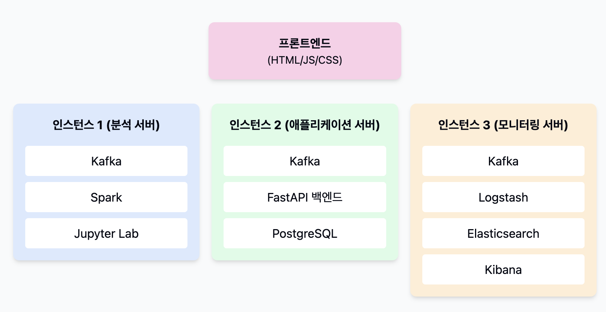
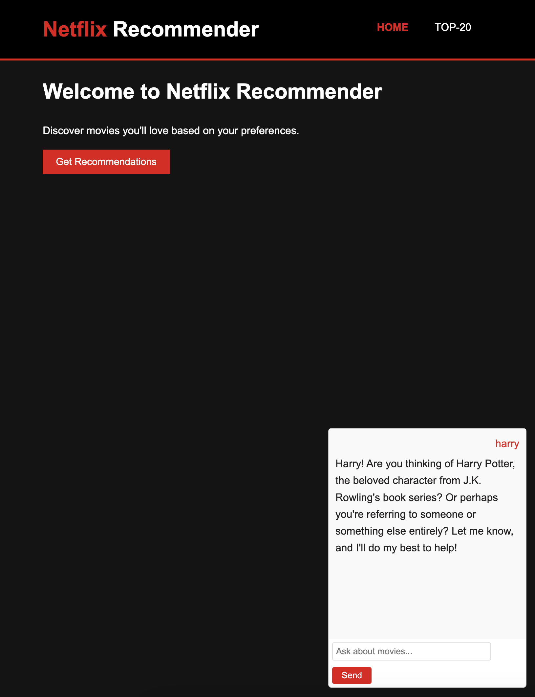
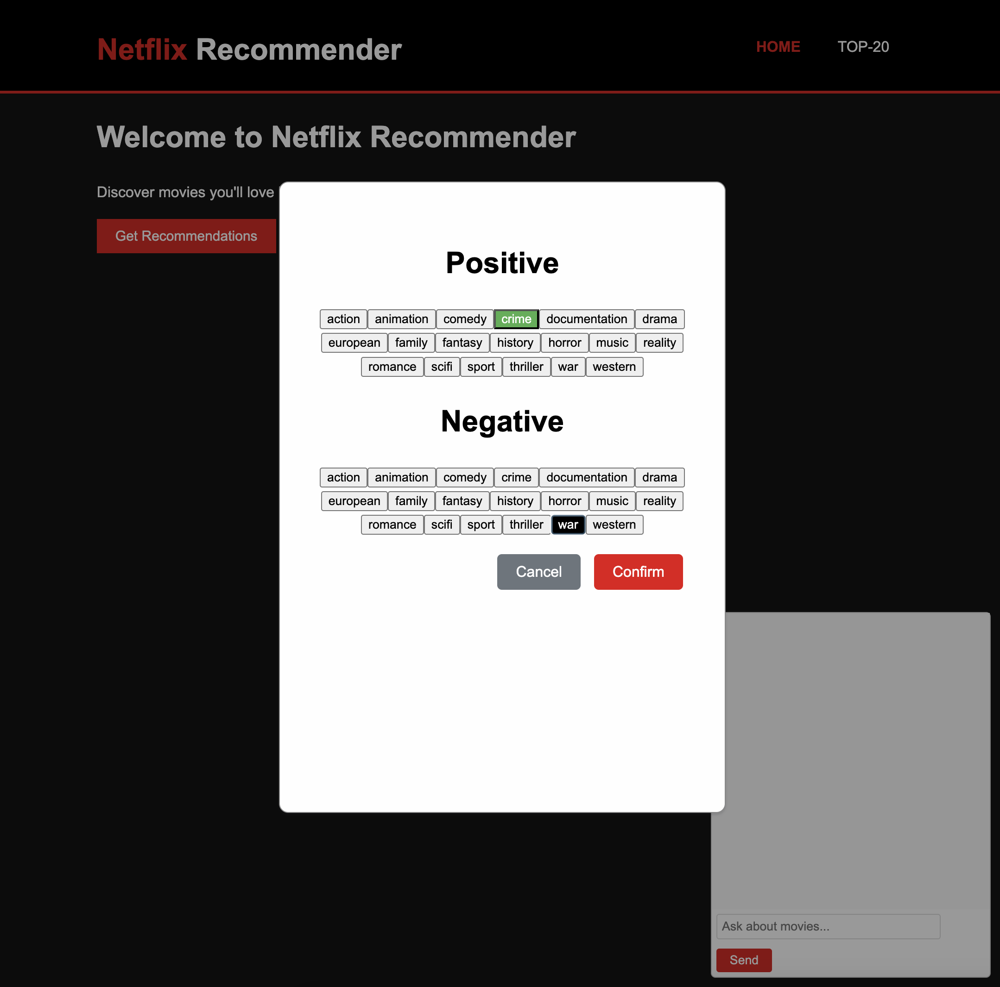
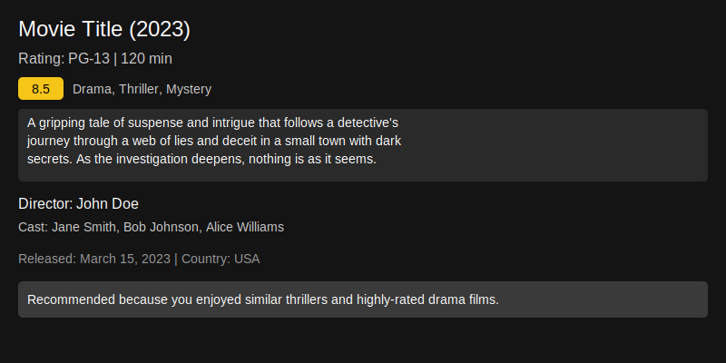
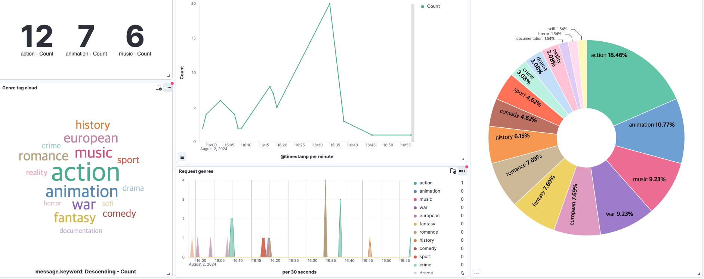

# Netflix 콘텐츠 추천 시스템

## 프로젝트 개요
이 프로젝트는 PySpark를 사용하여 
Netflix 데이터셋 기반의 영화 추천 시스템을 구현합니다. 
FastAPI를 사용한 백엔드 API, 기본적 프론트엔드 인터페이스, ELK 스택을 활용한 모니터링 시스템, 그리고 Kafka를 이용한 실시간 데이터 처리 기능을 구현하고 있습니다.

## 시스템 아키텍처



## 주요 기능
주요 기능으로는 
- 사용자 장르 선호도 기반 영화 추천
- 장르 기반 필터링
- 실시간 데이터 처리 (Kafka 활용)
- 추천 결과 시각화 (데이터 분석용)
- 로그 및 시스템 모니터링 (ELK 스택 활용)
- LLM 기반 챗봇 서비스 (Ollama 활용)

## 기술 스택
- 백엔드: FastAPI, PySpark
- 프론트엔드: HTML, CSS, JavaScript
- 데이터베이스: PostgreSQL
- 메시지 큐: Apache Kafka
- 데이터 처리: PySpark, Pandas
- 분석 도구: Jupyter Lab
- 모니터링: Elasticsearch, Logstash, Kibana (ELK 스택)
- 컨테이너화: Docker, Docker Compose

## 프로젝트 구조
```
.
├── docs
│   ├── setup_and_run.md
│   └── mermaid.md
├── backend
│   ├── spark
│   │   ├── recommendation_engine.py
│   │   ├── streaming_to_postgres.py
│   │   ├── imdb_movies_shows.csv
│   │   └── netflix_titles.csv
│   ├── kafka
│   └── modify_data
├── pages
│   ├── app.js
│   ├── app.py
│   ├── exam_file.svg
│   ├── Index.html
│   ├── ollama_api.py
│   ├── pages_explain.md
│   ├── recommend.js
│   ├── recommendation-settings.html
│   ├── return_express.js
│   ├── top-20.html
│   ├── top-20.js
│   └── unify.css
├── parquet_data
├── logstash
│   └── pipeline
│       └── logstash.conf
├── docker-compose.yml
├── Dockerfile.fastapi
├── .gitignore
├── netflix-recommendation-architecture.svg
├── README.md
└── requirements.txt
```

## 설치 및 실행 가이드

### 사전 요구사항
- Docker 및 Docker Compose 설치
- Git

### 환경 변수 설정
1. 프로젝트 루트에 `.env` 파일 생성:
```bash
# PostgreSQL
POSTGRES_USER=user
POSTGRES_PASSWORD=password
POSTGRES_DB=netflix

# Kafka
KAFKA_BOOTSTRAP_SERVERS=kafka:29092

# Elasticsearch
ELASTICSEARCH_URL=http://elasticsearch:9200
```

### Docker를 이용한 설치 및 실행

1. 프로젝트 클론
```bash
git clone [repository-url]
cd content-recommendation-platform
```

2. Docker 컨테이너 실행
```bash
docker-compose up -d
```

3. 서비스 확인
- FastAPI 서버: http://localhost:8000
- Jupyter Lab: http://localhost:8888
- Kibana 대시보드: http://localhost:5601
- Spark UI: http://localhost:8080

4. 서비스 중지
```bash
docker-compose down
```

### 수동 설치 및 실행 (Docker 없이)

각 인스턴스별 설치 방법은 아래와 같습니다:

#### 인스턴스 1: 데이터 처리 및 분석 서버
1. Java 및 Python 설치
2. Kafka 클러스터 설정
3. Spark 설치 및 구성
4. Jupyter Lab 설치 및 설정

#### 인스턴스 2: 애플리케이션 서버
1. Python 및 필요한 라이브러리 설치
2. FastAPI 애플리케이션 설정
3. 프론트엔드 파일 배포
4. Kafka 클라이언트 설정

#### 인스턴스 3: 모니터링 서버
1. Java 설치(JVM)
2. ELK 스택 설치 및 구성
3. Logstash 파이프라인 설정
4. Ollama 설치 및 설정

## 트러블슈팅

### 일반적인 문제 해결

1. Docker 컨테이너가 시작되지 않는 경우
```bash
# 로그 확인
docker-compose logs [service-name]

# 컨테이너 재시작
docker-compose restart [service-name]
```

2. Kafka 연결 문제
- `kafka:29092`가 아닌 `localhost:9092`로 접속 시도
- Zookeeper 상태 확인

3. Elasticsearch 메모리 부족
- Docker 설정에서 메모리 제한 확인
- ES_JAVA_OPTS 환경변수 조정

4. Spark 작업 실패
- Spark UI에서 로그 확인
- 메모리 설정 확인

### 데이터 초기화
필요한 경우 다음 명령으로 데이터 초기화:
```bash
docker-compose down -v  # 볼륨 삭제
docker-compose up -d    # 재시작
```

## 개발자 가이드

- 코드 스타일: Black 및 Flake8을 사용하여 일관된 코드 스타일 유지
- 테스트: Pytest를 사용한 단위 테스트 및 통합 테스트 구현
- 문서화: 각 주요 함수 및 클래스에 대한 문서 문자열(docstring) 작성
- 브랜치 전략: Git Flow 사용

## 실행 화면




